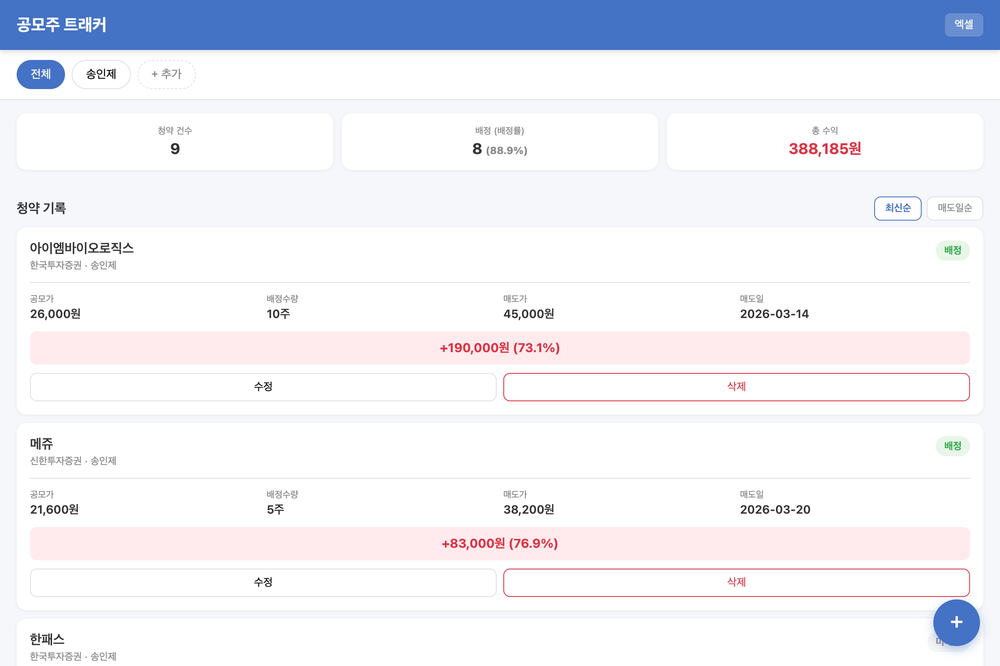
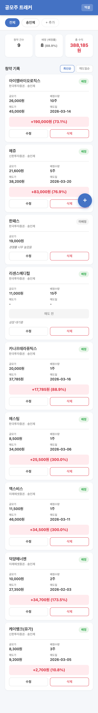
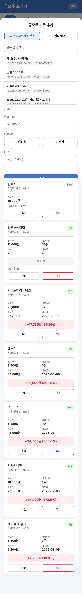

# 공모주 트래커

가족 단위로 한국 공모주(IPO) 청약 기록을 관리하고, 수익을 추적하는 웹 애플리케이션입니다.

## 스크린샷

### 메인 화면 (데스크탑)


### 메인 화면 (모바일)
<p align="center">
  
</p>

### 공모주 기록 추가
<p align="center">
  
</p>

## 주요 기능

- **공모주 자동 조회** — 38커뮤니케이션에서 최근 공모주 목록을 자동으로 불러와 선택 가능
- **증권사 자동 매칭** — 종목 선택 시 해당 주간사(증권사) 목록 자동 표시
- **종목 검색** — 공모주 이름으로 검색
- **페이지네이션** — 과거 공모주 데이터도 불러오기 가능
- **가족 구성원 관리** — 탭으로 구성원별 기록 분리
- **수익 자동 계산** — (매도가 - 공모가) × 배정수량 = 수익금 + 수익률
- **통계 대시보드** — 청약 건수, 배정률, 총 수익 한눈에
- **정렬** — 최신순 / 매도일순 정렬
- **엑셀 내보내기** — .xlsx 파일로 다운로드
- **반응형 UI** — 모바일(아이폰) 최적화

## 기술 스택

| 구분 | 기술 |
|------|------|
| 백엔드 | Python, FastAPI |
| DB | SQLite |
| 프론트엔드 | HTML, CSS, JavaScript (바닐라) |
| 공모주 데이터 | 38커뮤니케이션 크롤링 |
| 엑셀 | openpyxl |

## 설치 및 실행

```bash
# 클론
git clone https://github.com/ssongjay/gongmoju-tracker.git
cd gongmoju-tracker

# 가상환경 생성 및 패키지 설치
python3 -m venv venv
source venv/bin/activate
pip install -r requirements.txt

# 실행
python main.py
```

브라우저에서 `http://localhost:8000` 접속

> 같은 네트워크에서 가족이 접속하려면 `http://[컴퓨터IP]:8000`

## 사용법

1. **구성원 추가** — 상단 탭에서 `+ 추가` 클릭
2. **공모주 기록 추가** — 우하단 `+` 버튼 클릭
   - 최근 공모주 목록에서 선택하거나 직접 입력
   - 증권사 선택 → 배정 여부 → 수량/매도가 입력
3. **수익 확인** — 카드에서 수익금/수익률 자동 계산
4. **엑셀 다운로드** — 우상단 `엑셀` 버튼

## 데이터 저장

모든 데이터는 프로젝트 폴더의 `gongmoju.db` (SQLite) 파일에 저장됩니다.
이 파일만 백업하면 데이터가 보존됩니다.

## 라이선스

MIT
