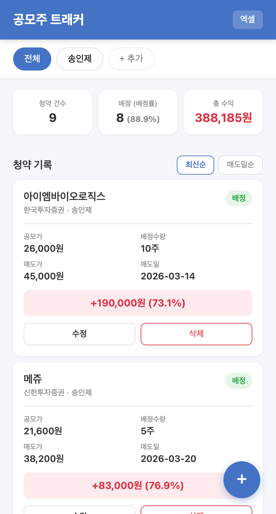

# 공모주 트래커

한국 공모주(IPO) 청약 기록을 관리하고, 수익을 추적하는 데스크탑 애플리케이션입니다.

## 다운로드

[Releases](https://github.com/ssongjay/gongmoju-tracker/releases/latest) 페이지에서 OS에 맞는 파일을 다운로드하세요.

| OS | 파일 | 실행 방법 |
|----|------|-----------|
| **macOS** | `공모주트래커-mac.zip` | 압축 해제 → `공모주트래커.app` 더블클릭 |
| **Windows** | `공모주트래커-windows.zip` | 압축 해제 → `공모주트래커.exe` 더블클릭 |

> **macOS** — "확인되지 않은 개발자" 경고가 뜨면 우클릭 → 열기
>
> **Windows** — SmartScreen 경고가 뜨면 "추가 정보" → "실행" 클릭

별도 서버 배포 없이 로컬에서 바로 실행됩니다.

## 스크린샷

<p align="center">
  
  &nbsp;&nbsp;
  
</p>

## 주요 기능

- **공모주 자동 조회** — 38커뮤니케이션에서 최근 공모주 목록을 자동으로 불러와 선택 가능
- **증권사 자동 매칭** — 종목 선택 시 해당 주간사(증권사) 목록 자동 표시
- **종목 검색** — 공모주 이름으로 검색
- **페이지네이션** — 과거 공모주 데이터도 불러오기 가능
- **가족 구성원 관리** — 탭으로 구성원별 기록 분리
- **수익 자동 계산** — (매도가 - 공모가) × 배정수량 = 수익금 + 수익률
- **통계 대시보드** — 청약 건수, 배정률, 총 수익 한눈에
- **정렬** — 최신순 / 매도일순 정렬
- **엑셀 내보내기** — .xlsx 파일로 다운로드

## 기술 스택

| 구분 | 기술 |
|------|------|
| 백엔드 | Python, FastAPI |
| DB | SQLite |
| 프론트엔드 | HTML, CSS, JavaScript (바닐라) |
| 데스크탑 | pywebview, PyInstaller |
| 공모주 데이터 | 38커뮤니케이션 크롤링 |
| 엑셀 | openpyxl |

## 소스에서 직접 실행

```bash
git clone https://github.com/ssongjay/gongmoju-tracker.git
cd gongmoju-tracker

python3 -m venv venv
source venv/bin/activate
pip install -r requirements.txt

python main.py
```

브라우저에서 `http://localhost:8000` 접속

## 데이터 저장

- **데스크탑 앱**: `~/.gongmoju-tracker/gongmoju.db`에 저장 (앱을 삭제해도 데이터 유지)
- **소스 실행**: 프로젝트 폴더의 `gongmoju.db`에 저장

이 파일만 백업하면 데이터가 보존됩니다.

## 라이선스

MIT
